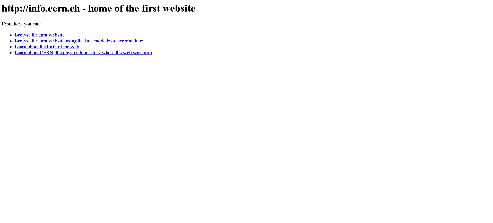
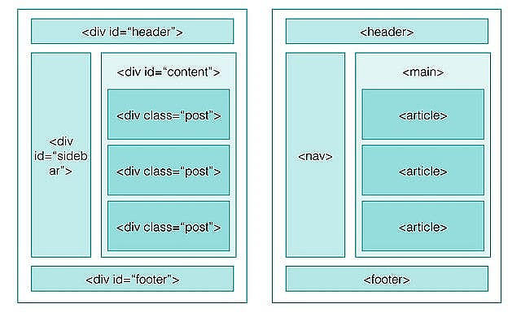
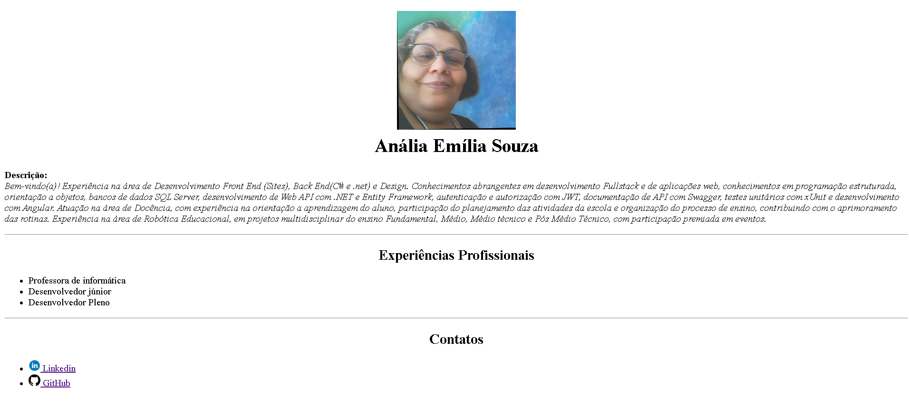

### Front-End - HTML

<details>
<summary>1 - HTML</summary>

> HTML é uma das linguagens que utilizamos para desenvolver websites. O acrônimo HTML vem do inglês e significa Hypertext Markup Language ou em português Linguagem de Marcação de Hipertexto.

> Criado pelo físico britânico Tim Berners-Lee em 2008, numa estação NeXTcube, usando o ambiente de desenvolvimento NeXTSTEP.

<div align="center">
    
<div>

> O HTML é a liguagem base da internet. Foi criada para ser de fácil entendimento por seres humanos e também por máquinas, como por exemplo o Google ou outros sistemas que percorrem a internet capturando informação.
</details>

<details>
<summary>2 - Curiosidade</summary>

> O primeiro website do mundo foi lançado por ele em 6 de agosto de 1991. O conteúdo simplesmente descrevia a forma de funcionamento dessa nova forma de conexão. O domínio era http://info.cern.ch , e até hoje está no ar em sua forma original.

<div align="center">

</div>

</details>

<details>
<summary>3 - Elementos HTML</summary>

- Um elemento é um componente que compõe o HTML. 
- Os elementos são compostos por tags. 
- Existem vários elementos, iremos ver adiante.

EX: 
```html
<elemento> <!-- Abertura do elemento -->
    conteúdo  <!--Conteúdo exibido pelo navegador-->
</elemento> <!-- Fechamento do elemento -->
```

- Alguns elementos:

  - `<p>`: Parágrafo
  - `<h1>`: Título
  - ``: Imagem
  - `<a>`: Link
  - `<ul>`: Lista não ordenada
  - `<ol>`: Lista ordenada
  - `button`: Botão


EX da tag `<p>`:
```html
<p>
    Conteúdo do parágrafo
</p>
```

EX da tag `<h1>`:
```html
<h1>
    Conteúdo do título
</h1>
```

EX da tag ``:
```html

```

EX da tag `<a>`:
```html
<a href="https://www.google.com">
    Link para o Google
</a>
```

EX da tag `<ul>`:
```html
<ul>
    <li>Item 1</li>
    <li>Item 2</li>
    <li>Item 3</li>
</ul>
```

EX da tag `<ol>`:
```html
<ol>
    <li>Item 1</li>
    <li>Item 2</li>
    <li>Item 3</li>
</ol>
```

EX da tag `<button>`:
```html
<button>
    Clique aqui!
</button>
``` 
</details>

<details>
<summary>4 - TAG Semâtica</summary>

<div align="center">

</div>

> Refere-se a elementos HTML que são usados para fornecer significado e estrutura ao conteúdo de um site, tornando-o mais compreensível para os navegadores, mecanismos de busca e pessoas que utilizam tecnologias assistivas. Essas tags ajudam a identificar claramente o propósito e o significado dos diferentes elementos do site.

EX: 

1. `<header>`: Representa o cabeçalho de um documento ou de uma seção.
```html
<header>
  <h1>Meu Site</h1>
  <nav>
    <ul>
      <li><a href="#">Página Inicial</a></li>
      <li><a href="#">Sobre</a></li>
      <li><a href="#">Contato</a></li>
    </ul>
  </nav>
</header>
```

2. `<nav>`: Define uma seção de navegação.

```html
<nav>
  <ul>
    <li><a href="#">Página Inicial</a></li>
    <li><a href="#">Sobre</a></li>
    <li><a href="#">Contato</a></li>
  </ul>
</nav>

```

3. `<main>`: Representa o conteúdo principal do documento.

```html
<main>
  <h2>Sobre</h2>
  <p>Informações sobre a empresa ou organização.</p>
</main>

```

4. `<article>`: Define um conteúdo independente e autossuficiente que pode ser distribuído separadamente.

```html
<article>
  <h3>Título do Artigo</h3>
  <p>Conteúdo do artigo.</p>
</article>
```

5. `<section>`: Representa uma seção genérica de conteúdo.

```html
<section>
  <h2>Serviços</h2>
  <ul>
    <li>Serviço 1</li>
    <li>Serviço 2</li>
    <li>Serviço 3</li>
  </ul>
</section>

```

6. `<aside>`: Define um conteúdo relacionado, mas separado do conteúdo principal.

```html
<aside>
  <h3>Anúncio</h3>
  <p>Texto do anúncio.</p>
</aside>

```

7. `<footer>`: Representa o rodapé do documento ou de uma seção.

```html
<footer>
  <p>&copy; 2023 Meu Site. Todos os direitos reservados.</p>
</footer>
```

</details>

<details>
<summary>5 - Atributos</summary>

- Atributos são propriedades que podem ser adicionadas aos elementos.
- Existem vários atributos, iremos ver adiante.

EX da tag `<a>`:
```html
<!-- o href é um atributo que tem o valor do link -->
<a href="https://www.google.com">
    Link para o Google
</a>
```

EX da tag ``:
```html
<!-- o src é um atributo que tem o valor da imagem -->

```

> OBS: cada elemento tem um atributo específico.
</details>

<details>
<summary>6 - Estrutura básica de uma página HTML</summary>
 
```html
<!DOCTYPE html>
<html>
<head>
<meta charset="UTF-8"/>
<title>Document</title>
</head>
<body>
...
</body>
</html>
```
> O DOCTYPE é usado para definir o tipo de documento que será renderizado. Nesse caso é o HTML versão 5.

> A tag `html` é responsável por definir o início do documento HTML.

> A tag `head` é onde fica localizado o titulo, icone que fica na aba do navegador, codificação dos caracteres, importação de arquivos CSS/JavaScript e etc.

> A tag `meta` são linhas de código `html` ou `etiquetas` que, entre outras coisas, descrevem o conteúdo do seu site para os buscadores. É nelas que você vai inserir as palavras-chave que facilitarão a vida do usuário na hora de te encontrar, por exemplo. 

> A tag `title` é utilizada para definir o título da página que é exibido na aba do navegador.

> A tag `body` é o corpo da página. É nela que fica todo o conteúdo que será exibido no navegador.
</details>


<details>
<summary>7 - Página exemplo</summary>

> Para criar uma página html, é necessário criar um arquivo e salvar com a extensão html e colocar o código dentro do arquivo.

```html
<!DOCTYPE html>
<html lang="en">

    <head>
        <meta charset="UTF-8">
        <meta http-equiv="X-UA-Compatible" content="IE=edge">
        <meta name="viewport" content="width=device-width, initial-scale=1.0">
        <title>Meu currículo</title>
    </head>

    <body>

        <header>
            <h1 align="center">
                
                <br />
                Anália Emília
            </h1>
            <p>
                <b>Descrição:</b>
                <br />
                <i>
                    Bem-vindo(a)!

                    Sua Anália Emília, tenho experiência na área de Desenvolvimento Front End (Sites), 
                    Back End(C# e .net) e Design. 
                    
                    Conhecimentos abrangentes em desenvolvimento Fullstack e de aplicações web, conhecimentos 
                    em programação estruturada, orientação a objetos, bancos de dados SQL Server, desenvolvimento de Web API com .NET e Entity Framework, 
                    autenticação e autorização com JWT, documentação de API com Swagger, testes unitários com xUnit e desenvolvimento com Angular.

                    Atuação na área de Docência, com experiência na orientação a aprendizagem do aluno, participação do planejamento das atividades 
                    da escola e organização do processo de ensino, contribuindo com o aprimoramento das rotinas. Experiência na área de Robótica 
                    Educacional, em projetos multidisciplinar do ensino Fundamental, Médio, Médio técnico e Pós Médio Técnico, com participação premiada
                    em eventos.
                </i>
            </p>
        </header>

        <hr>

        <main>
            <section>
                <h2 align="center">Experiências Profissionais</h2>
                <ul>
                    <li>Professora de informática</li>
                    <li>Desenvolvedor júnior</li>
                    <li>Desenvolvedor Pleno</li>
                </ul>
            </section>
        </main>

        <hr>

        <footer>
            <section>
                <h2 align="center">Contatos</h2>
                <ul>
                    <li>
                        <a href="https://www.linkedin.com/in/analiaemiliadev/">
                            
                            Linkedin
                        </a>
                    </li>
                    <li>
                        <a href="https://github.com/analianai">
                            
                            GitHub
                        </a>
                    </li>
                </ul>
            </section>
        </footer>
    </body>
</html>

```

> Navegador:



###### tags: `internet` `navegação`